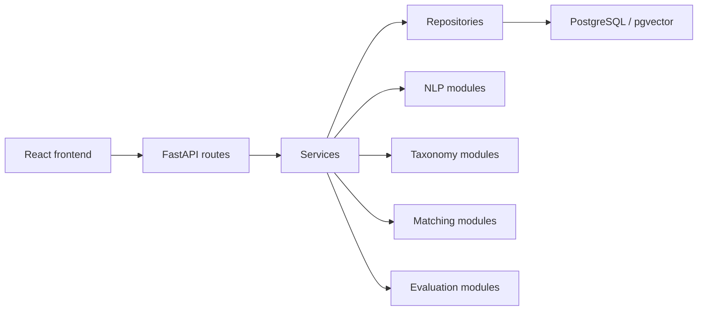

# Architecture

The project follows the required layered architecture:

Phase 1 implements the application shell, authentication, role-aware dependencies, database setup,
and deployment scaffolding. Later phases should extend the existing service and repository boundaries
instead of placing business logic in route handlers.
