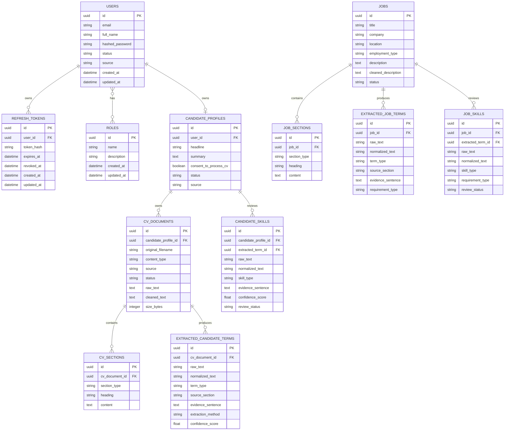

# Database ERD

Phases 1 and 2 create the authentication and document processing foundation.

Taxonomy, matching, and evaluation tables are reserved for the later phases described in the source
requirements.
